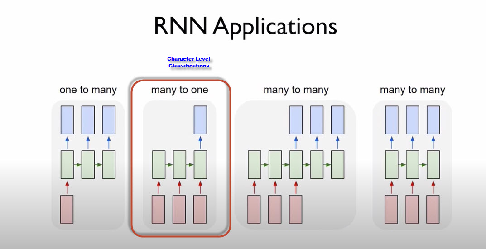
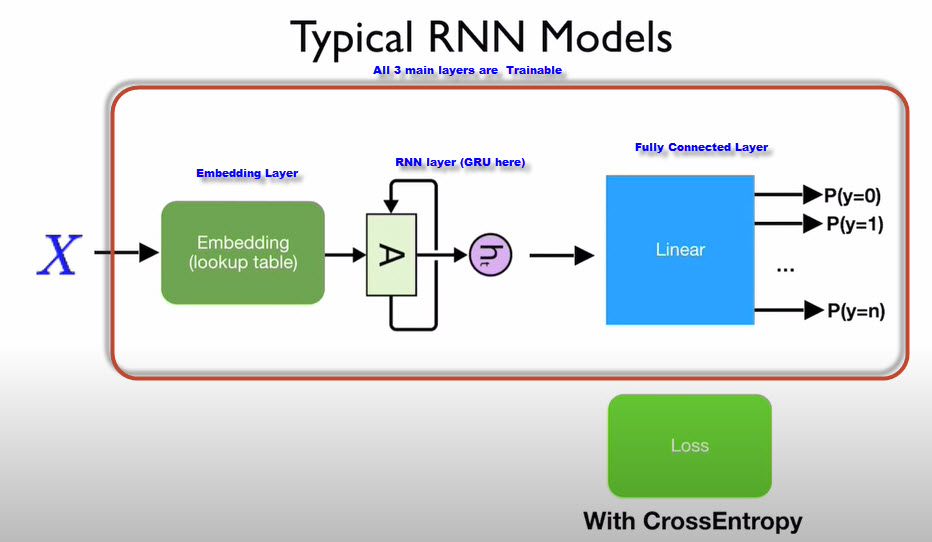
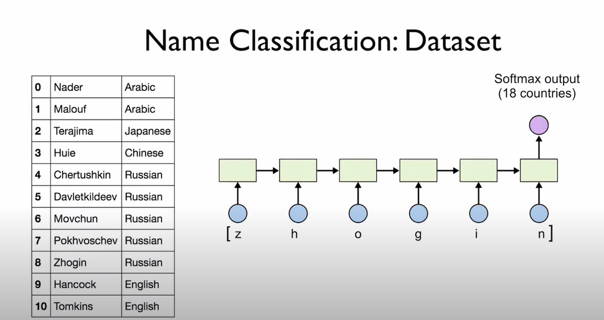
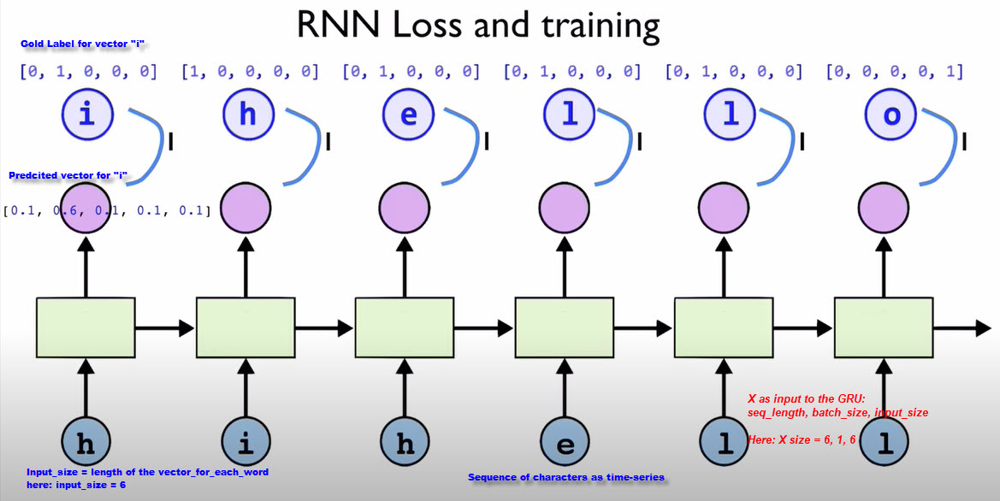
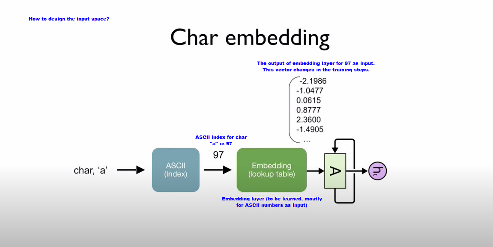
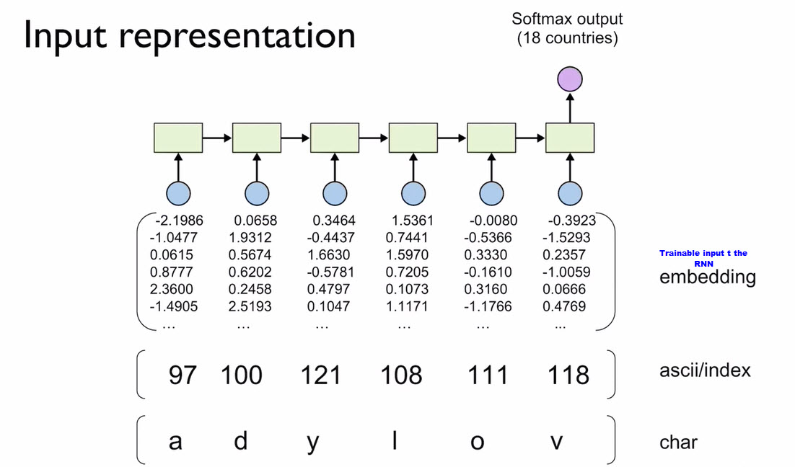
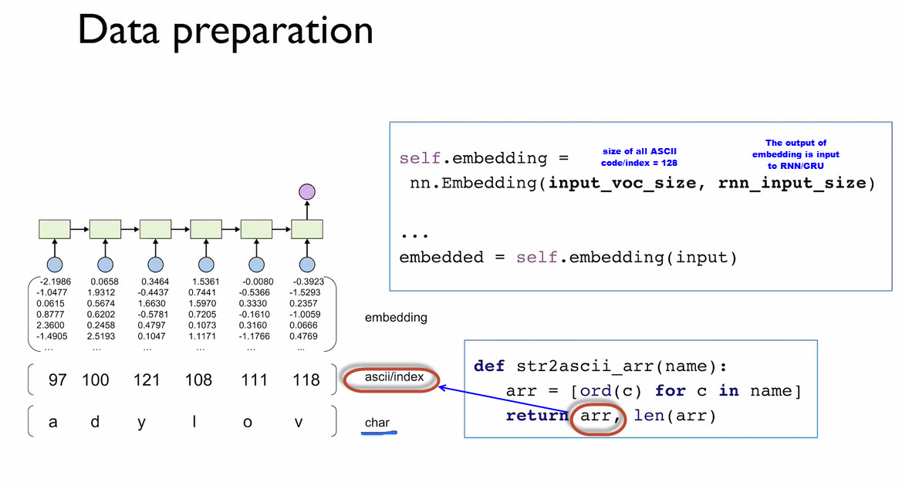
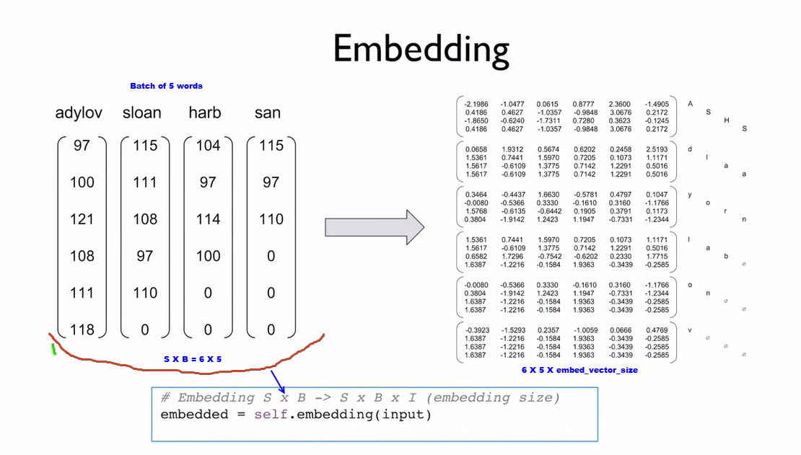

#Classifications

We want to predict the character after first 20 character of a phrase to determine if it is
a vowel or a constant (binary classification).

The train-constant-examples.txt, for example, contains many examples of 20 char each that
end with a constant 21st char (first class). In contrast, train-vowel-examples.txt, contains
many examples of 20 char that will be followed with a vowel char (second class).

The simplest calssification approach and based on counting. We predict the 21st char based on
the 20th char.

Before dive into the explanations, the RNN has many applications in NLP. The classification problem, more fits into 
the many-to-one pattern below. And I guess the text generation next part fits more many-to-many at far-right picture below.

Picture below shows th overall Typical RNN model in Pytorch. Usually we have an embedding layer (which is trainable),
then the actual RNN layer (which can be a GRU or LSTM), and finally the linear, fully connected layer that 
does the classification.

The last linear layer can either be only for the last cell output of the RNN (classification), or after each cell-output of
the RNN layer (text generation: next part)

If we look closer only the RNN layer, it is basically the sequence of cells. Each cell gets an input, a hidden state
 from previous cell, and it generates an output and an output-hidden-state to be passed to the next cell.
 
 This current classification, is more likely the pattern below. Obviously the picture below is for classification
 for 18 nationalities based on the name as input to the RNN.
 
 
 
 If we get more into details, and for a second if we assume we want to do the text generation (rather than the classification, picture above),
 we can see how the loss is calculated.
 If we assume we have the linear classification layer after each output of each cell in this RNN, then we get a probablility 
 distribution. Here, we assumed we have 6 classes, and we get the probability distribution for these 6 classes. Also,
 we have a gold-label, which is basically the next character that we kow in the training step. For instance, in the picture
 below, we know the gold label for the first cell is the character "i", then the gold prob distribution is [0, 1, 0, 0, 0, 0].
 
 
 
 #### The role of ASCI code:
 If we assume we are doing classification of text generation on char level. Then, we might have a wide variety of characters
 lower-case, upper-case, signs, so on so forth. In these cases, it would be good to translate the input to ASCII code (
 which output a number between 0 to 286?? ). This ASCII code, then would be the input to embedding layer, meaning each
 row in embedding look-up correspond to one of this 286 ASCII number and translates it to a embdedded verctor. 
 
 

Picture below shows how each character in word "adylov" gets into ASII number first, then, we transform these ASCII numbers
into embedded vector of size XXX as input to each cell in RNN unit. As noted above, the embedding layer is trainable, meaning
the output representative vectors will be learned by the network. 

 
 
 Getting this ASCII number in Python is just easy:
 
 
 
 #### Padding concept:
 Since the phrases into the RNN might not be as of the same length, we need to padd them with zero. In this way, batching 
 would be possible.
 Picture below shows how we have a batch of 4 words (mistakenly marked as 5 batch in the picture). The words are not in the same length
 and are padded with zero, before feeding into the embedding-layer in a batch fashion.
 
 

