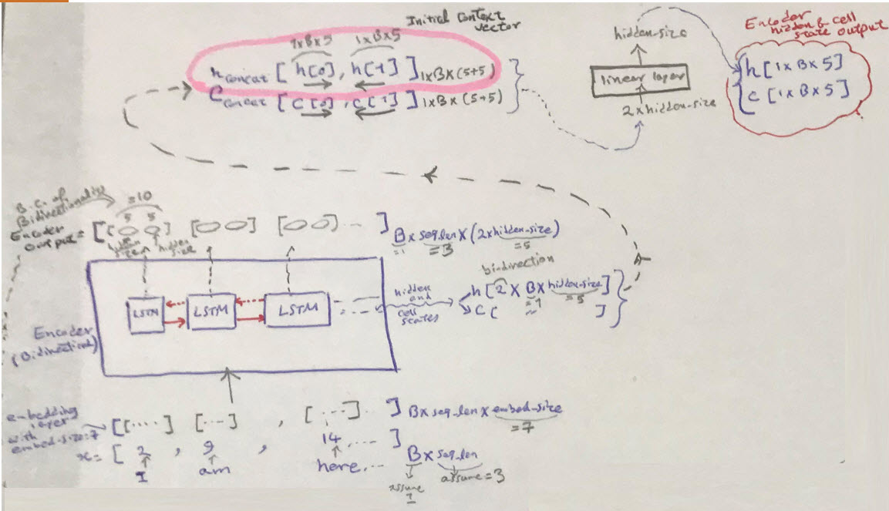
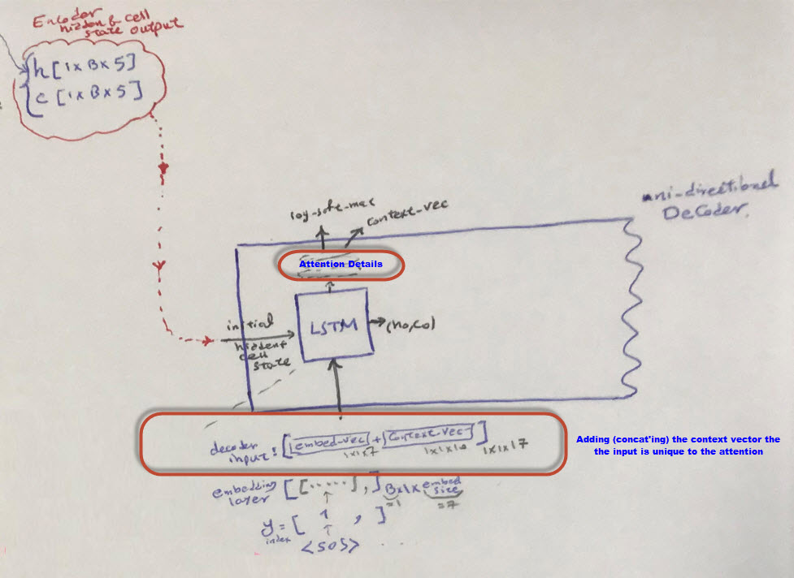
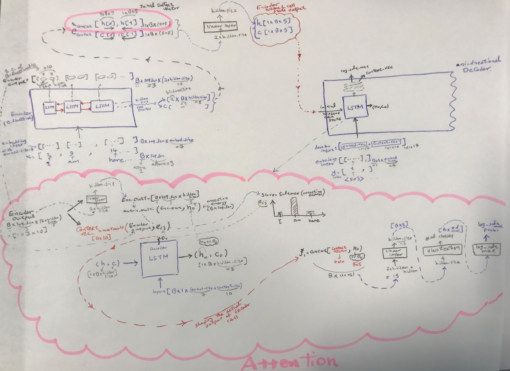
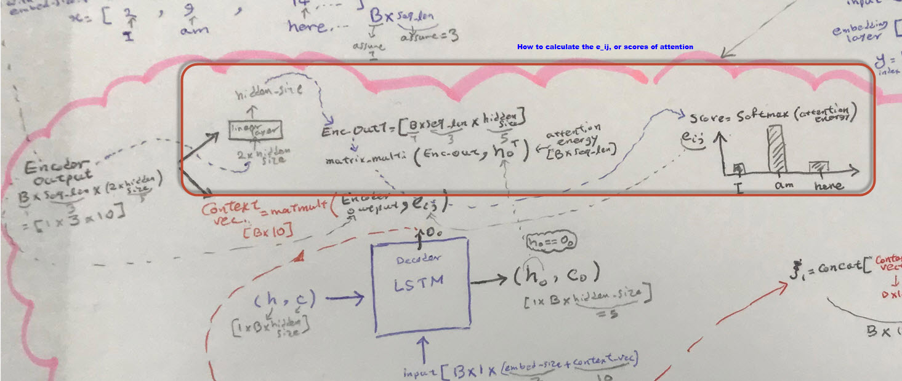
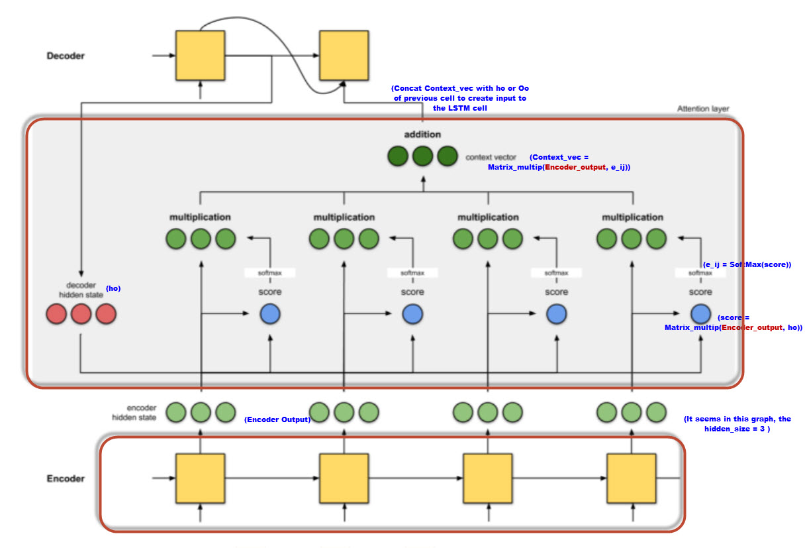

# Semantic Parsing with Encoder-Decoder

#### Background
There are two tasks that are explored in this script: (1) parsing, and (2) translation
* **Parsing**:
    * Semantic parsing is basically translation of a sentence (in English) to a
Lambda ($ \lambda $) expression. Two example of input and the labeled output (the lambda expression)
are as follows:

        * which state is the smallest ? _answer ( A , _largest ( A , _state ( A ) ) )
        * which is the longest river in usa ? _answer ( A , _largest ( A , _state ( A ) ) )

    This task is kind of similar to a Translation task, but I guess easier to train.

    In practice, encoder-decoder models can learn simple structural constraints such
    as parenthesis balancing (when appropriately trained), and typically make errors
    that reflect a misunderstanding of the underlying sentence, i.e., producing a
    valid but  logical form, or “hallucinating” things that weren’t there.

    Similar to translation task, we need to use attention to improve the encoder-decoder
    (seq2seq) model. Among two methods/approaches of attention (Bahdanau attention, Luong
    attention), we focus on the latter one.

* **Translation**:
    * It is basically translation from English to France. The original dataset is huge, We might want to train and test
    on a smaller size of dataset. Some setting must be done on the main.py, in the args section, to select the
    translation task versus parsing task, and the location for the corresponding training data.
    * If translation task is chosen, the dataset shoud be downloaded from http://www.manythings.org/anki/
    and download fra-eng.zip file, and put the fra-eng.txt file into the data folder of this project.
	* The translation task here is very similar to what Google published in 2014, and later improved by attention concept.
	A good reference to how Google Neual Translate works in the youtube video 
	at: https://www.youtube.com/watch?v=AIpXjFwVdIE&ab_channel=CSDojoCommunity
 
* **Seq2Seq as Language Model**:
    * BERT is not a language model, since it can not be used for text or sequence generation. What we have here is a
    language model, since in both tasks above we generate a text in decoder, based on what we have in encoder.
    * Similar to BERT, here our encoder is bidirectioal (though no transformer)

#### Indexing
FOr parsing task, indexing for each sentence is done in a way that at the end, each sentence goes from a list of
integers to another list of inetgers, similar to translation:

* what are the rivers of montana ? => _answer ( NV , ( _river ( V0 ) , _loc ( V0 , NV ) , _const ( V0 , _stateid ( montana ) ) ) )
* indexed as: [2, 3, 4, 5, 6, 7, 8] => [3, 4, 5, 6, 4, 7, 4, 8, 9, 6, 10, 4, 8, 6, 5, 9, 6, 11, 4, 8, 6, 12, 4, 13, 9, 9, 9, 9, 2]

# Limitation of current code
* number of layers in LSTM: currently only 1 layer is implemneted. If more than layer wanted, changes need to be made in
forward section of Encoder and Decoder classes
* number of batches: Currently, it is written only for one batch. If more than one batch wanted, some changes in the code required.
* Beam search for length > 1 is not tested, and probably is not working
* RNN type is currently LSTM.
* The code can be run on Google-Colab, but since only 1 batch can be handled, running on Colab just is worse.


# Attention
 Good read and the difference between two approaches for attention
 * https://towardsdatascience.com/attn-illustrated-attention-5ec4ad276ee3
 *  https://blog.floydhub.com/attention-mechanism/
 
 The details of implementation here are as follows:
 
 ### Encoder part:
 * Th input sentence is getting into the list of indexes (bag of words), and then it will be going through an embedding
 layer.
 * The LSTM will output:
    * The Encoder Output: Since our LSTM-RNN model is bodirectional, the output will have the size of [B X seq_len X (2*hidden_size)]
    * The original hidden and cell states, each, will be in [2 X B X hidden_size] (2 is due to being bi-directional). But this is
      mot our final output. We need to make (1) a context vector, which will act as initial context vector for the decoder, and
      (2) also, the actual hidden state and cell state output that does not have the bidirectionality effect in the size. In other
      word they should be in [1 X B X hidden_size]
        1. _**Context Vector**_ : concat hidden state for each direction. This will double the size of the tensor, and will be
         [1 X B X (2*hidden_size)]
        2. _**Encoder Hidden and Cell state output**_ : Repeat the item 1, above for the cell state, and then pass it through a linear layer, to make both cell state and
         hidden state as [1 X B X hidden_size]
   
 

### Decoder part:
* In decoder, as expected, we go one word by one word. The initial word always the the "<SOS>" token. It will be in
int index form (bag of words), and then into the embedding layer.
* One unique thing to the Attention method, we will not directly input the embedded vector into the LSTM cell. We, instead,
concat the embedded vector with the context vector (which for the 1st cell is coming from the encoder).
* The hidden and cell states for the first LSTM cell is coming from the encoder, as well.
* The LSTM cell creates (ho and co) and also a raw output. At this point, ho is identical to output.
* Details of attention will be explained later.

 
 
### Attantion Details:
* Attention can be pictured as a layer right on top of the ear-output of decoder LSTM cell, that can get the output ready
for the next cell.
* Processing of the Encoder output to calculate the $'e_{i,j}'$ and also the context vector for the next cell.
    * _**creating e_ij vector**_ : We get the Encoder output, passing through a linear layer to make it with only one
    hidden_size dimension tensor, then multiply it with the ho or Oo of the current LSTM cell. Passing this through the
    softmax will give us the score or the energy, which basically tells of what workd in input to attend.
    * _**Context Vector**_ : By matrix multiplication of the e_ij calculated above and the Encoder output, the context
     vector is calculated.
     
* Having the context vector, now we can build the output of the first cell of the Decoder.
    * Concat the context vector with the ho (or Oo).
        * This is one way of combining the context vector with the ho. There are also other methods.
    * Pass it through a linear layer, to make it in hidden_size dimension tensor.
    * Pass it through a classifications layer.
    * Pass it through a log-soft-ma layer. Having log-soft-max as output basically make this model suitable to use NLLoss class.
   

 


 


* As shown in the reference, for the 2nd cell in the Decoder LSTM cell, we can follow the steps above, as shown in the
 picture below.
 
  

 
 

# Lesson for running on GoogleColab
1) the model should go to cuda (use .to(device) for models)

2) Any data right after the looping for various batches should go to cuda

3) If a torch Variable is defined, or torch.zeros, ... They all must be transfered to cuda device

4) We should not use  in place operations. That could cause issues in gradient back calculations.

5) Inside the Google Colab:
```
import torch
print(torch.cuda.is_available())

!mkdir data
!mkdir log

!pwd

!mv "/content/geo880_test280.tsv"  "/content/data"
!mv "/content/geo880_train600.tsv" "/content/data"
!mv "/content/geo_dev.tsv" "/content/data"
!mv "/content/geo_test.tsv" "/content/data"
!mv "/content/geo_train.tsv" "/content/data"

%load_ext tensorboard
%tensorboard --logdir ./log/ --port 6006

!python3 main.py

```